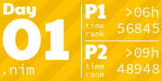
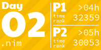
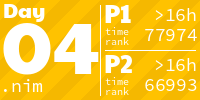
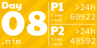
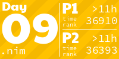

# advent-of-code-2023
Another year, another attempt to solve challenges from [adventofcode.com](adventofcode.com). Mostly in Nim 👑

## Install Nim
```sh
curl https://nim-lang.org/choosenim/init.sh -sSf | sh
```

## Create and run template

```sh
./create.sh <day-number>
nim c -o:bin/day<number> -d:release -r day<number>.nim
```

## Solutions
<!-- AOC TILES BEGIN -->
<h1 align="center">
  2023 - 10 ⭐
</h1>
<a href="day01/day01.nim">
  
</a>
<a href="day02/day02.nim">
  
</a>
<a href="day03/day03.nim">
  
</a>
<a href="day04/day04.nim">
  
</a>
<a href="day05/day05.nim">
  
</a>
<a href="day06/day06.nim">
  
</a>
<a href="day07/day07.nim">
  
</a>
<a href="day08/day08.nim">
  
</a>
<a href="day09/day09.nim">
  
</a>
<!-- AOC TILES END -->